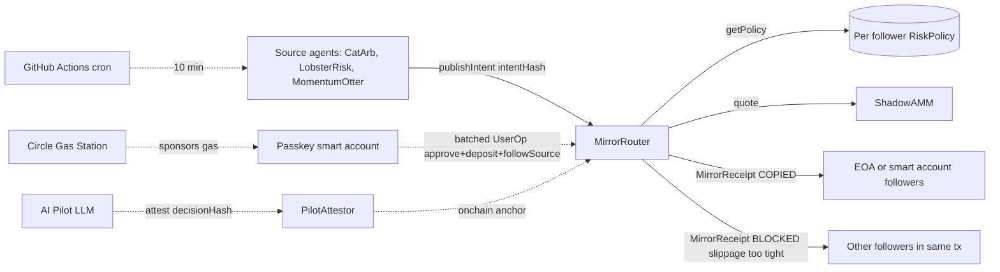

# Shadow

**Shadow Float lets autonomous agents buy x402 services before their own wallet is funded.**

Shadow fronts Arc USDC for approved x402 purchases, records fee-inclusive debt onchain, restores capacity on repayment, and blocks unsafe spends before treasury funds move. That Float loop is the primary proof path.

Shadow Treasury / M1 is the supporting mandate extension: approved adapters authenticate the account, read a bonded enforcer's ALLOW/BLOCK decision, and only move vault-style USDC on ALLOW. It is a verified design extension over live Arc receipts, not a claimed production treasury customer or real Morpho deployment.

Primary proof: https://shadow-arc.vercel.app/float

Supporting proof: https://shadow-arc.vercel.app/treasury

## Primary Float Proof

| Surface | What to check |
| --- | --- |
| Float contract | `0xf305647ba0ff7f1e2d4be5f37f2ef9f930531057` |
| Live state API | `GET https://shadow-arc.vercel.app/api/float` |
| Live proof page | https://shadow-arc.vercel.app/float |
| No-secret verifier | `npm run float:verify-live` |
| Signed intent verifier | `GET /api/float-tools?action=verify&hash=0x...` |

The live API exposes `proofChecks`, receipt rows, treasury reserve, x402 binding txs, debt, repayment, block, denial, source breakdowns, and the current standing board. The verifier command independently checks the live contract, receipt count, reserve backing, x402 transfer, `X402PaymentBound` event, debt math, repayment, block, and denial without private keys.

## Supporting Treasury / M1 Proof

| Surface | What to check |
| --- | --- |
| Treasury page | https://shadow-arc.vercel.app/treasury |
| Live Treasury API | `GET https://shadow-arc.vercel.app/api/treasury` |
| Combined verifier | `npm run treasury:verify-live` |
| Float contract | `0xf305647ba0ff7f1e2d4be5f37f2ef9f930531057` |
| Mandate registry | `0xe3cf1a4d54f627f599255142cef4bf9b8c361a4c` |
| Bonded enforcer | `0x1825f447c0aa8e64dd2d290cdce85d82993d0e1e` |
| Morpho-style adapter | `0xba9f134f7b13dadd45dcf16b09c5121a7555e2c5` |

The live Treasury API and verifier check that one operator:

1. Paid an x402 provider through Float and bound the settlement onchain.
2. Opened fee-inclusive Float debt for that provider payment.
3. Allocated `0.1` Arc testnet USDC through the M1 vault adapter after an `ALLOW` receipt.
4. Attempted a `0.3` USDC over-limit allocation that emitted `BLOCK / AMOUNT_TOO_HIGH` without moving vault funds.
5. Left both rails verifiable without private keys. The live `/api/treasury` response currently returns 25 pass/fail checks for the same proof path.

The proof anchors are intentionally direct:

| Proof | Link |
| --- | --- |
| x402 settlement tx | `0x516d95ed55d61663c491f2cccb45d1d16d83967bdcc6fc66899d05426fea80ab` |
| Float bind tx | `0x7fe14e70081f682017d5804250f9db6b0dc7416fe1eb100f7135c6e34007d103` |
| Vault allocation tx | `0x9836e74ee95907847fac464f3a65554cf314adab9efe7141f4644022b3e09c17` |
| Blocked allocation tx | `0x7d3dddd89dc50ea5b410564c7f1134ce1350fd3687e8cefec74192d9e9b4bd23` |

The M1 receipt fields are not just labels. The allowed allocation receipt checks `decision = ALLOW`, `reason = NONE`, `amount = 0.1 USDC`, `actor = operator`, and `target = Morpho-style adapter`. The blocked allocation receipt checks `decision = BLOCK`, `reason = AMOUNT_TOO_HIGH`, `amount = 0.3 USDC`, and verifies that no vault USDC transfer occurred.

External technical review: CitePay validated the architecture fit for agent/x402 policy enforcement. Forum reviewed the live Arc transactions and confirmed the core enforcement claim: the same vault adapter entrypoint moved `0.1` USDC when allowed, then moved zero USDC on the over-limit path while the bonded enforcer logged the block decision.

Scope: **external Float usage is live and verifiable; Treasury/M1 proof is a supporting verified extension backed by public receipts, contract links, and the read-only verifier.**

## M1 Boundaries and Post-Hackathon Hardening

The M1 proof uses hardened approved adapters. Those adapters authenticate the account and honor the enforcer's ALLOW/BLOCK result before moving funds. The current claim is therefore bounded to approved adapters and the public proof path, not arbitrary third-party adapters.

Post-hackathon hardening is explicit:

- Move from adapter-enforced checks to a custodial or escrow-release enforcer for stronger fund-control guarantees.
- Replace the proof sink with a withdrawable/redeemable vault integration before calling it production treasury management.
- Integrate a real Morpho or vault market instead of the current Morpho-style proof adapter.
- Expand bonding from receipt-liveness guarantees to correctness and settlement guarantees.
- Replace operator-reviewed underwriting evidence with a permissionless receipt indexer.

## Float Economic Loop

1. An agent has a behavior-backed spending line but does not need to pre-fund the x402 call.
2. The x402 provider requires USDC.
3. Shadow's facilitator fronts the provider payment in Arc USDC.
4. `ShadowFloat.recordX402Spend` binds the x402 settlement hash onchain and opens debt against the agent.
5. Repayment reduces debt and restores available capacity.
6. Oversized or denied spends emit receipts without moving treasury funds.

What is proven now:

- A Float line can be granted from reviewed onchain behavior.
- A deterministic v0 score/limit formula now exists in `ShadowFloat.deterministicScore`, `recommendedLimitUSDC`, and `grantFloatFromScore`.
- A signed agent intent can trigger a treasury-funded x402 payment.
- The operator script verifies the x402 USDC transfer before `recordX402Spend` binds the settlement hash to the onchain request hash.
- Debt and available capacity update onchain.
- Oversized spends and denied agents produce receipts without moving treasury USDC.
- Repayment restores capacity.
- Optional line expiry, default marking, reserve-safe treasury withdrawals, and fee-accrued debt are covered in the contract test suite.
- The live verifier can be run without secrets: `npm run float:verify-live`.

What is not claimed yet:

- The score formula is deterministic v0 and available in contract/API, but current Lepton lines still use operator-reviewed evidence counts rather than a permissionless scoring indexer.
- The Float contract binds operator-verified x402 payment evidence; the EVM contract cannot independently inspect a prior HTTP/x402 transaction or subjective service quality.
- Operators are trusted owner-approved executors: they front the x402 payment, verify the USDC transfer offchain, and then bind the settlement hash onchain.
- Invited builder signatures are external usage tests, not partnerships.

## Circle Integration

| Tier | Role |
| --- | --- |
| Load-bearing in Float today | Float settles on Arc USDC over x402 using EIP-3009 authorization. Every current Float draw uses this path. |
| Next milestone | Circle Gateway-batched x402. In lab, Shadow paid an independent Gateway-batched Arc x402 seller, but per-transfer onchain settlement binding into Float receipts remains roadmap work. Float's current judged proof stays on the live EIP-3009 path. |
| Proven onboarding capability | Shadow has demonstrated Circle Modular Wallets and Gas Station for passkey-based, gas-sponsored onboarding. This can onboard Float agents, but it is not core to the current Float draw. |

## Treasury Economics and Mainnet Roadmap

The live testnet proves mechanics, not meaningful revenue. At mainnet scale, Shadow Treasury should be funded by operators, protocols, or liquidity providers who reserve capital against total available capacity and mandate budgets. Float draws can accrue a small fee into the agent's debt; mandate execution can later add a managed-volume fee once that rail is explicitly built. Repayments return principal plus Float fee, creating the sustainability loop for treasury capital and default reserves.

The mainnet need is capital delegation. A protocol or business should be able to let an agent pay providers and allocate USDC without hot-funding an unconstrained agent wallet. The current proof shows the rails; the next validation step is an external treasury owner using those rails under its own policy.

## Prior Shadow Foundation

Built on Shadow's proven receipt-and-policy primitive: the earlier copy-capital system settled **2,893 onchain receipts across 30 follower wallets**. Float is the payment rail; M1 is the allocation rail; Treasury is the focused product frame.

Live app: https://shadow-arc.vercel.app

GitHub: https://github.com/dolepee/shadow

Chain: Arc Testnet (chain id `5042002`)

Lepton M1 mandate docs: [`docs/LEPTON_M1.md`](docs/LEPTON_M1.md)

Mainnet path: [`docs/MAINNET_PATH.md`](docs/MAINNET_PATH.md)

Economics: [`docs/ECONOMICS.md`](docs/ECONOMICS.md)

Milestone roadmap: [`docs/ROADMAP.md`](docs/ROADMAP.md)

## Judge quickstart

Requires Node.js, pnpm, and Foundry (`forge`) on PATH. The app and agent keep separate pnpm lockfiles under `app/` and `agent/`.

```bash
git clone https://github.com/dolepee/shadow
cd shadow
pnpm --dir app install --frozen-lockfile
pnpm --dir agent install --frozen-lockfile
npm run contracts:test
npm run contracts:build
npm run app:typecheck
npm run app:build
npm run agent:typecheck
curl -s https://shadow-arc.vercel.app/api/treasury
npm run float:verify-live
npm run treasury:verify-live
```

The app, Float proof, and Treasury proof can be reviewed without private keys at https://shadow-arc.vercel.app. `GET /api/treasury`, `npm run float:verify-live`, and `npm run treasury:verify-live` are read-only and use the public Arc RPC by default. `npm run verify:slippage` is an optional live-write verifier for the older copy-capital rail and requires `ARC_RPC_URL` plus the deployment/operator environment.

## Historical Copy-Capital Archive

The sections below document the earlier Shadow copy-capital adapter. They are not the current Float submission path.

### What made the earlier adapter work

Three competing source agents. Each publishes its own intents with ERC-8004-style identity references stored in `SourceRegistry`. Followers stake one or many. The router scores them onchain through `MirrorReceipt` (per intent decisions) and `PositionClosed` (realized PnL). The Watch Signal panel turns those receipts into a Healthy / Watch / Stop badge per agent. No off chain leaderboard.

### The binary moment

CatArb published intent 48 at block 42697895. The ShadowAMM was thin. Five distinct followers, five different settings, one tx:

| follower | minBpsOut | outcome | reason |
| --- | --- | --- | --- |
| `0x7A3F...3AcD` | 9000 | COPIED | swap cleared, mirror fee accrued |
| `0x495c...8695` | 10000 | BLOCKED | slippage too tight |
| `0x26bA...63c5` | 9500 | BLOCKED | slippage too tight |
| `0xbad3...4BAF` (EOA) | 9500 | BLOCKED | slippage too tight |
| `0x5768...a006` (passkey smart account) | 9500 | BLOCKED | slippage too tight |

One source intent, five receipts in one tx, no cascade revert. The slippage rail caught a real thin fill on four wallets and let the one wallet that accepted the risk through.

Tx: https://testnet.arcscan.app/tx/0xfdc46c79e15e8fe05264f664ac4facfe971fa07c67a7a091d0ac24e6313ef739

### Meet the Pilot

Shadow Pilot is the protagonist. A follower hands it a deposit and a risk profile. The Pilot:

1. **Reads** every source agent's live onchain reputation (intents published, copy rate, mirror fees earned, realized PnL).
2. **Allocates** the deposit across 1 to 3 sources through a Bankr LLM gateway call, with a deterministic heuristic fallback if the LLM is unreachable.
3. **Attests** the SHA 256 hash of its plan onchain through `PilotAttestor.attest(decisionHash)` before a single token moves.
4. **Executes** the plan as `approve` plus `depositUSDC` plus `followSource` per slice, with the slippage rule baked into each policy.
5. **Monitors** every active follow after the fact, scores each source as healthy / watch / stop from fresh chain state, and proposes a re plan that anchors a new decision hash if the watch signal trips.

The Pilot is not advice. It proposes the onchain policy and leaves an audit anchor on every plan it commits to; `MirrorRouter` owns the refusal rail. The receipts table above is that policy holding the line on a thin intent.

### Pilot-labeled refusal receipts

Shadow does not add a new `PILOT_VETO` enum to the deployed router. The onchain receipt remains the source of truth: `MirrorReceipt(BLOCKED, RiskPolicy.BlockReason, ...)`.

The UI can attach a **Pilot veto** label when a blocked receipt shares the same `intentHash` as the latest Pilot reasoning packet. In that case the receipt row shows the Pilot label first, then the raw onchain reason underneath (for example, `raw onchain reason: slippage too tight`). This keeps the demo honest: the Pilot explains why an intent was risky, while `MirrorRouter` still enforces the follower's actual policy onchain.

CatArb intent 151 at block 43176529 is the stable reference proof for that join. The live feed may advance as cron and verifier intents publish, but this transaction remains the recording/reference proof: same source intent, nineteen follower receipts in one transaction, three visible classes at a glance: copied, Pilot-vetoed policy refusal, and mechanical balance refusal.

| follower | minBpsOut | outcome | UI label | raw onchain reason |
| --- | --- | --- | --- | --- |
| `0x7A3F...3AcD` | 9000 | COPIED | 0.1 USDC → 0.00224 ARCETH | n/a |
| `0x495c...8695` | 10000 | BLOCKED | Pilot veto: live quote failed policy | slippage too tight |
| `0x26bA...63c5` | 9500 | BLOCKED | Pilot veto: live quote failed policy | slippage too tight |
| `0xbad3...4BAF` | 9500 | BLOCKED | Pilot veto: live quote failed policy | slippage too tight |
| `0x6101...f78b` | 9000 | BLOCKED | Pilot veto: follower budget rejected | amount too high |
| `0x5768...A006` (passkey) | 9500 | BLOCKED | none (mechanical) | insufficient balance |

The Pilot label is suppressed on the passkey row because wallet balance is not a Pilot decision. The other insufficient-balance rows on intent 151 render the same way: clean onchain reason, no derived label.

Tx: https://testnet.arcscan.app/tx/0x0f1892d3a99f3ef303019f3aa59bce30718432aa5a5b03bf288053da60ff0563

## Why Circle, not just any EVM

Circle's thesis is that USDC becomes the rail for the agent economy. Shadow makes that safe enough to use: every follower gets a policy boundary, every source agent gets an earned reputation trail, and every copy or refusal becomes an Arc receipt.

The fifth follower in the table above (`0x5768...a006`) is a passkey owned smart account. It onboarded itself in one batched ERC-4337 UserOp with three calls packed into one signature:

1. `approve(USDC)` for the router
2. `depositUSDC(0.04 USDC)` into the router
3. `followSource(CatArb, 0.02, 0.04, ARCETH, 2, 9500)` to register the policy

Circle Gas Station paid the gas. The user paid zero ARC. The Modular Wallets SDK derives the smart account from a device passkey (Face ID, Touch ID, or platform authenticator), so there is no seed phrase and no native gas faucet step.

Sponsored UserOp tx: https://testnet.arcscan.app/tx/0x6ba9fb6eb5268ad5ca979a3813d5bd4b888d8a06c85609d52e6a71cc2939ffbc

Without the sponsored batch, onboarding adds 3 signatures (`approve`, `depositUSDC`, `followSource`) and a gas token step (acquire ARC, fund EOA, then sign), turning a single passkey tap into roughly 60 to 90 seconds with at least one external dependency (faucet or bridge). With sponsored UserOp it is one tap on the device. That is the integration test for Circle Modular Wallets + Gas Station, and removing it actually degrades onboarding.

## Try it in 30 seconds

1. Open https://shadow-arc.vercel.app
2. Scroll to the Circle stack panel under the agent grid
3. Tap "Register passkey" on your device
4. Tap "Fund smart account" (a deployer EOA tops you up with 0.05 USDC, once per address). If you already have USDC, the UI detects the balance and skips this step
5. Pick the agent you trust most from CatArb, LobsterRisk, or MomentumOtter
6. Tap "Follow {agent} (approve, deposit, followSource, sponsored)"

The whole onboarding settles in one batched UserOp. Circle pays the gas. You leave as a Shadow follower with your own slippage policy on the one agent you chose. No bulk subscription, no auto split.

After follow, the /agents page shows a live **Healthy / Watch / Stop** badge per agent. Come back to see whether your pick is still earning trust.

Sizing: the sponsored follow gives you a 0.04 USDC router balance and a 0.02 USDC per intent cap. Cron source intents are sized to fit that cap and will hit either `COPIED` or `SLIPPAGE_TOO_TIGHT` against you. The dashboard "run live test" button publishes a larger 0.1 USDC intent, which a sponsored smart account will refuse with `INSUFFICIENT_BALANCE`. That is the rail working: the BlockReason is precise per follower, not a generic revert.

## Agent-facing protocol surface

Shadow is a protocol first and a dashboard second. The dashboard uses the same contracts and APIs that another agent can call directly.

| Surface | Purpose | Current status |
| --- | --- | --- |
| `SourceRegistry.registerSource` | Register a source agent identity, strategy URI, and fee split | Owner-managed in V4, permissionless bonded registration is mainnet-path work |
| `MirrorRouter.followSource` | Subscribe a follower to a source with `maxAmountPerIntent`, `dailyCap`, asset allowlist, risk tier, and `minBpsOut` | Live on Arc testnet |
| `MirrorRouter.publishIntent` | Source agent publishes a standardized intent to the router | Live on Arc testnet through three cron source agents |
| `MirrorReceipt` | Canonical event for `COPIED` or `BLOCKED` per follower | Live on Arc testnet |
| `PositionClosed` | Realized PnL event after a copied position closes | Live on Arc testnet |
| `POST /api/agent/follow-plan` | Agent-facing helper that returns ready-to-sign calldata for `approve`, `depositUSDC`, and `followSource` | Live on `shadow-arc.vercel.app` |
| `GET /api/state` | Cached state for sources, receipts, positions, fees, and AMM reserves | Live on `shadow-arc.vercel.app` |
| `GET /api/reasoning` | Latest source reasoning packet joined to receipt UI labels | Live on `shadow-arc.vercel.app` |
| `GET /api/reasoning-x402` | Paid agent preview for source reasoning via Arc USDC EIP-3009/x402 flow | M1 proof point; see [`docs/X402.md`](docs/X402.md) |
| `GET/POST /api/settlements` | Circle Gateway per-copied-receipt nanosettlement; blocked mirrors are rejected before payment | Credential-gated M1 path; see [`docs/GATEWAY.md`](docs/GATEWAY.md) |
| `ShadowFloat.recordX402Spend` | Behavior-backed agent float: gate the spend, bind the x402 tx hash, reimburse the facilitator, and open debt | Live proof at `/float`; script: `npm run float:x402-proof` |
| `GET /api/float` | Browser-readable Float receipt chain, treasury, agent lines, blocked/denied totals, x402 binding txs, and the `standingBoard` | Live on `shadow-arc.vercel.app/float` |
| `GET /api/float-tools?action=agent&address=0x…` | Composable standing read for any agent: line limit, available capacity, active debt, status, behavior score, and Lab/Invited/Self-test/Demo label | Live; the read other agents and protocols call |
| `GET /api/float-tools?action=rationale&hash=0x…` | Publishes the rationale preimage for a receipt's `requestHash` so anyone re-hashes it to confirm the agent's on-chain reasoning | Live; `requestHash = keccak256(preimage)` |
| `GET /api/float-tools?action=verify&hash=0x…` | Verifies an external builder's signed Float x402 intent against current-contract onchain receipt state and the matching `X402PaymentBound` bind tx | Live; signed external usage only |
| `GET /api/float-tools?action=score&address=0x…` | Deterministic v0 underwriting verifier: recomputes suggested score and line from public Float evidence | Live; mirrors the contract formula |
| `ShadowFloat.deterministicScore` / `grantFloatFromScore` | Onchain v0 formula and deterministic line grant once evidence counts are submitted | Contract path for reviewed evidence-backed lines |

The mainnet target is simple: source agents register themselves, follower agents or humans attach policies, and Shadow becomes the shared receipt and reputation layer for Arc's USDC agent economy.

### Query an agent's Float standing

Float is a spending-line layer other agents plug into. Read any agent's standing over REST, or straight from the contract's public `lines(address)` view.

```bash
# One agent's standing
curl "https://shadow-arc.vercel.app/api/float-tools?action=agent&address=0xYOURAGENT"

# The whole standing board, labeled Lab / Invited / Self-test / Demo
curl "https://shadow-arc.vercel.app/api/float" | jq .standingBoard

# Verify the reasoning behind a receipt: re-hash the published preimage to its requestHash
curl "https://shadow-arc.vercel.app/api/float-tools?action=rationale&hash=0xREQUESTHASH"

# Recompute the deterministic v0 Float score for an agent
curl "https://shadow-arc.vercel.app/api/float-tools?action=score&address=0xYOURAGENT"
```

```ts
import { createPublicClient, http, parseAbi } from "viem";

const client = createPublicClient({ transport: http("https://rpc.testnet.arc.network") });
const floatAbi = parseAbi([
  "function lines(address agent) view returns (address wallet, uint16 score, uint256 creditLimitUSDC, uint256 availableCreditUSDC, uint256 activeDebtUSDC, uint8 status, uint64 lastReview, bytes32 mandateId, uint64 day, uint256 spentTodayUSDC)",
]);

// ShadowFloat on Arc testnet
const standing = await client.readContract({
  address: "0xf305647ba0ff7f1e2d4be5f37f2ef9f930531057",
  abi: floatAbi,
  functionName: "lines",
  args: ["0xYOURAGENT"],
});
// standing[3] = availableCreditUSDC: what this agent can spend now without pre-funding it
```

## Agent native: run Shadow with no browser

Shadow is an agent to agent protocol. The dashboard is one access path. The contracts are the actual interface.

* **Source side is already autonomous.** CatArb, LobsterRisk, and MomentumOtter are EOAs driven by a GitHub Actions cron. They publish a content addressed intent every 10 minutes with no human in the loop.
* **Follower side runs headless too.** `agent/src/headless-follower.ts` is a ~210 line agent that generates a fresh EOA, funds itself from the deployer, then runs `approve` + `depositUSDC` + `followSource` + watches `MirrorReceipt` events + calls `closePosition` on any COPIED intent. Four real onchain txs per agent, no UI involved.

```bash
pnpm agent:headless-follower
# optional:
# HEADLESS_FOLLOWER_PRIVATE_KEY=0x...   reuse the same agent EOA
# HEADLESS_WATCH_SECONDS=900            extend the receipt watch window
# HEADLESS_SOURCE=0x...                 follow a different registered source
```

A live run on an independent operator's VPS captured the full cycle end to end. Agent `0x28178A86…cd93F36` observed a CatArb COPIED receipt and called `closePosition` 13 seconds later, with both txs landing onchain:

* Receipt tx (intent 117 COPIED, 0.02 USDC mirrored): [`0x89ec09ff…7577bb`](https://testnet.arcscan.app/tx/0x89ec09ff64b5ede91123eb3d8a5bc2a671492bcc494c76ac726a42d9f27577bb)
* PositionClosed tx (pnlBps `-60`, 0.01988 USDC out): [`0x2f1cca4b…421813`](https://testnet.arcscan.app/tx/0x2f1cca4b7854f9a7d9967ac6263cc2616b34b1b8662fe96ff83acb89df421813)

The only Shadow surface that requires a human is the Circle Modular Wallets + Gas Station path, and only because WebAuthn passkeys are device bound by design. Any pure agent skips that path and goes EOA, which is exactly what `headless-follower` does.

* **Agent-facing follow planner.** `POST /api/agent/follow-plan` accepts `{ sourceAgent, follower, preset }` and returns ready to sign calldata for `approve`, `depositUSDC`, and `followSource` against the live Arc router, plus the policy summary and expected receipt behavior. Agents that hold a private key can hit this endpoint, sign the three transactions, and onboard without parsing the dashboard.

```bash
curl -X POST https://shadow-arc.vercel.app/api/agent/follow-plan \
  -H "content-type: application/json" \
  -d '{"sourceAgent":"0xBDb1e0718EC6f6e2817c9cd4e5c5ed25Ac191Fb8","follower":"0x0000000000000000000000000000000000000000","preset":"balanced"}'
```

## Rubric fit (30 / 30 / 20 / 20)

**Agentic Sophistication (30%).** Two cooperating autonomous surfaces. The source side runs as a GitHub Actions cron that publishes content addressed intents every 10 minutes with no human, and the follower side can run fully headless through `agent/src/headless-follower.ts`, which generates an EOA, funds itself, follows a source, watches receipts, and closes COPIED positions onchain. The dashboard is one access path, not the protocol. Shadow Pilot sits inside this same agent surface as a multi step onchain agent. It reads live source reputation from `MirrorRouter` and `SourceRegistry`, calls the Bankr LLM gateway to weight a deposit across 1 to 3 sources, anchors the SHA 256 decision hash onchain through `PilotAttestor.attest`, then commits the plan as approve plus deposit plus `followSource` per slice. After commit, the same agent runs Live Monitor: it rescores active follows from fresh chain state (last receipts, closes, mirror fees, PnL), classifies each source as healthy / watch / stop, and proposes a re plan that anchors a new decision hash if a watch trips. Underneath it, three cron source agents publish content addressed intents every 10 minutes from GitHub Actions and `MirrorRouter` evaluates each follower policy onchain at intent time, emitting a receipt per follower with the exact block reason if denied. Every copy-or-block policy boundary is enforced onchain, not in the browser.

**Traction (30%).** Real follower wallets with real onchain receipts. The table above lists five distinct follower addresses on a single intent, each having bound USDC to a policy that the router enforced. The passkey smart account in the table onboarded through Circle Gas Station and produced a live onchain receipt, not a placeholder. Follow count, intents published, mirrored USDC, and blocked receipts are visible on the dashboard hero stats and are read directly from chain logs. The "External follower receipts" section below lists registered followers from outside the deployer.

**Circle Tool Usage (20%).** One load bearing integration: Modular Wallets plus Gas Station for sponsored follower onboarding (`src/main.tsx` `ModularWalletCard`). Removing it adds 3 signatures and a gas token step, turning a one tap passkey onboard into a ~60 to 90 second multi step EOA flow.

**Innovation (20%).** The novel primitive is slippage each follower owns. A source publishing a tight `minAmountOut` no longer cascade reverts a batch of followers, because each follower's `minBpsOut` is evaluated against the live quote at the receipt event. Sponsored ERC-4337 onboarding for policy-controlled mirroring is unusual in this space; most mirroring products require the follower to hold the chain's gas token first.

## External follower receipts

**30 distinct follower wallets are registered on the router** (one is the deployer running a follower for end-to-end QA; the other 29 are external passkey followers that registered through the public Shadow app). Across the three source agents: CatArb 19, LobsterRisk 13, MomentumOtter 7 (some followers follow more than one source). Eight are highlighted below with their most distinctive onchain action.

| follower | onboarded via | action | tx |
| --- | --- | --- | --- |
| [`0x6101f858…3df78b`](https://testnet.arcscan.app/address/0x6101f858c3a8c019758296caab2d139ae63df78b) | passkey + Circle Gas Station | accepted 10% slippage on LobsterRisk (`minBpsOut` 9500 → 9000) | [`0x89dc1bf3…31aa4`](https://testnet.arcscan.app/tx/0x89dc1bf30413bd8b30f3527800e71d46c7ef59921c10ae5cacaf12b75b331aa4) |
| [`0xfb4276b0…3c4891`](https://testnet.arcscan.app/address/0xfb4276b0cf1a752a3dc8e07f20f3fa351a3c4891) | passkey + Circle Gas Station | switched source agent CatArb → LobsterRisk mid session | [`0xb90e8c19…05223`](https://testnet.arcscan.app/tx/0xb90e8c19d290555045311134d5b4a9efc868fb392d8f171c45ec3fa2f5805223) |
| [`0xf651b39a…a55c01`](https://testnet.arcscan.app/address/0xf651b39a700a01c36f9bcdc4aecc95fedea55c01) | passkey + Circle Gas Station | switched LobsterRisk → MomentumOtter 6 minutes apart | [`0x64ca5384…9595e`](https://testnet.arcscan.app/tx/0x64ca5384b65ea576276c457cb89a00f2116b8f4b5a48a2efa4ff2deac279595e) |
| [`0x6c069f3e…c43ded`](https://testnet.arcscan.app/address/0x6c069f3e392979b65fe3d17a59c3063058c43ded) | passkey + Circle Gas Station | follow CatArb from a secondary PC | [`0x8f630a9e…17db2`](https://testnet.arcscan.app/tx/0x8f630a9ef34a74b1345501dffce903e58f65aa054dc09668e32a7be052117db2) |
| [`0x5daef0c6…d6749`](https://testnet.arcscan.app/address/0x5daef0c6a09e6c83dc3f2d3866ead1787d8f6749) | passkey + Circle Gas Station | follow LobsterRisk on iPhone, picked non default source | [`0x8c00ee0a…11cc2`](https://testnet.arcscan.app/tx/0x8c00ee0a6d93b31ebe782a865d631280dcb9112e6d858c3aca3b70395a311cc2) |
| [`0x1cB74072…a12066`](https://testnet.arcscan.app/address/0x1cB74072a947275A4712309a82845676e6a12066) | passkey + Circle Gas Station | follow MomentumOtter from Android at 10% slippage preset, then ran live test from the homepage ([publish tx](https://testnet.arcscan.app/tx/0x851ec3b43a63dbd910db5eb2615d00b5108fa825b2affe6ff74c814c810721c3)) | [`0x3308bede…6d928d`](https://testnet.arcscan.app/tx/0x3308bede9d812a59f5cba9c73c81ac8031130116359a5d7cf343a1f4646d928d) |
| [`0x495cb55e…538695`](https://testnet.arcscan.app/address/0x495cb55e288e9105e3b3080f2a7323f870538695) | EOA via direct router calls | subscribed to all three source agents at zero slippage tolerance (`minBpsOut` 10000), 2.0 USDC max per intent — only copies when AMM quote matches source `minAmountOut` exactly | [`0xca81ad57…2bf57`](https://testnet.arcscan.app/tx/0xca81ad579b242243e761e8825de639a7d4b33f98626b4909d8d83992b462bf57) |
| [`0x411341bf…01931`](https://testnet.arcscan.app/address/0x411341bf2172ccba5f7c10fa18bb490c16e01931) | passkey + Circle Gas Station | re-tuned CatArb slippage 3 times in 97 seconds (`minBpsOut` 9500 → 9000 → 9000), A/B testing copy thresholds onchain | [`0xd6853a8a…c306ce`](https://testnet.arcscan.app/tx/0xd6853a8a058496b11e33d230f0fa78ed1e0ab91048fdba1a07bd9e8103c306ce) |

The dashboard live feed shows every receipt as it lands.

## Architecture



## The novel primitive: refusal each follower owns

Source agents publish one intent. Each follower stores their own policy on chain (`minBpsOut`, `maxAmountPerIntent`, `dailyCap`, `allowedAsset`, `maxRiskLevel`). `MirrorRouter` evaluates every follower at the receipt event and emits one `MirrorReceipt` per follower with the exact reason. Three distinct refusal reasons coexist in the same tx:

1. `SLIPPAGE_TOO_TIGHT`. Quoted asset out is below the follower's `minBpsOut * intent.minAmountOut`. No fee, no debit, follower keeps balance.
2. `INSUFFICIENT_BALANCE`. Follower's router USDC is below `intent.amountUSDC + mirrorFee`. No revert, no fee, balance untouched.
3. `DAILY_CAP_EXCEEDED`. Copying this intent would push `spentToday` past `dailyCap`. Auto rolls over at the next UTC day boundary, no keeper.

Everyone else executes in the same tx without reverting the batch. Every refusal leaves an onchain receipt naming the exact policy field that fired, so a follower can prove what their policy blocked, not just that something blocked.

## Watch Signal: trust that can flip

Every source agent on `/agents` carries a live badge derived purely from chain state:

| Signal | Trigger |
| --- | --- |
| **Healthy** | copy rate ≥ 50% and realized PnL avg ≥ -1% (or no closes yet) |
| **Watch** | copy rate 25 to 50% **or** realized PnL avg between -5% and -1% |
| **Stop** | copy rate < 25% **or** realized PnL avg < -5% |
| **Warming** | no follower activity yet |

Copy rate is `copied / (copied + blocked)` receipts. Realized PnL is the average `pnlBps` over `PositionClosed` events for the agent. No model, no LLM, no off chain truth. Same input data the dashboard already loads from `MirrorReceipt` and `PositionClosed` logs.

The framing is intentional. Shadow is not "follow this guru forever." Trust is an onchain artifact that ages out of date the second an agent's hit rate decays. The badge gives a follower a return reason: open Shadow weekly to check whether their agent is still earning copy.

The badge flips in both directions. If you open `/agents` right now you may see a source on **Stop** because its current intent sizing is tight against live AMM depth, while another source on **Healthy** because it is sized for the current pool. Same router, same followers, different fit. That is the rail honestly reporting state, not a curated leaderboard.

## The product surface

**Shadow Pilot (RFB 06 aligned).** Detailed flow in "Meet the Pilot" above. The Pilot is the agent. Surface in this section is the execute panel that exposes its plan (weights, watch signals, preset per slice) and the single button that anchors `PilotAttestor.attest(decisionHash)` and fires the per slice batch.

**Live AI monitor.** Same agent, post commit phase. Reads the last receipts and closes touching the wallet, rescores each followed source, and offers one click re plan that anchors a new decision hash. The previously anchored plan stays the audit anchor for everything between the two attestations.

**Sponsored onboarding (Circle Modular Wallets + Gas Station).** Device passkey derives a Circle MSCA. One batched UserOp approves USDC, deposits, and registers the follower policy. Circle Gas Station pays the gas. The smart account leaves as a real onchain follower.

**Public follow flow (EOA).** Pick a source, pick a preset, deposit USDC. A single CTA wires up `approve`, `depositUSDC`, and `followSource` with the preset policy.

**Live receipts feed.** Auto polls a cached state API, animates new rows, shows the latest block, source name, follower address, USDC mirrored, and ARCETH received per receipt. Filter chips at the top let you narrow by outcome (copied / blocked), by agent (CatArb / LobsterRisk / MomentumOtter), and by block reason (slippage too tight, insufficient balance, daily cap exceeded), so the proof of a specific policy refusal is one click away.

**Spotlight intent.** Renders the latest intent that produced both COPIED and BLOCKED outcomes side by side. A `run live test` button publishes a fresh CatArb intent every click through a Vercel serverless function so the split outcome is reproducible on demand.

**Realized close loop.** Copied positions can be closed through `closePosition(intentId)`. The router reverse swaps ARCETH back into USDC, credits the follower's idle router balance, and emits `PositionClosed` with PnL in basis points.

**Scheduled activity.** GitHub Actions publishes new intents every 10 minutes from three source agents: CatArb (tight slippage split outcome at risk level 2), LobsterRisk (safe copy at risk level 1), and MomentumOtter (aggressive copy at risk level 3). It then closes up to two copied positions so the dashboard continues to accumulate realized PnL events.

## Live Arc deployment (V4)

Contracts:

* ARCETH: `0x9beB19B1F360F110f731A09BA3fccB0E0cAE2402`
* ShadowAMM (V4): `0x917700Df306bDd84418369e24E7dfe2E0fd8D697`
* SourceRegistry: `0xEec07657c5628AeCe50f20AA12C15A2a4B1557e1`
* MirrorRouter (V4): `0xcB300Ac9f5944Fd06F39329cf5d871C9B92C6655`
* PilotAttestor: `0xc65d60d1b281d7711d3b808cec833a450e0c1840`
* Arc USDC: `0x3600000000000000000000000000000000000000`

V4 turns every copied intent into a tracked position. Router holds the ARCETH it bought and records `Position{sourceAgent, assetAmount, usdcIn, closed}` per `(intentId, follower)`. Followers later call `closePosition(intentId)`, which reverse swaps the asset on ShadowAMM v2 (`swapExactAssetForUSDC`), credits the realized USDC back to `followerBalanceUSDC`, and emits `PositionClosed(intentId, follower, sourceAgent, usdcIn, usdcOut, pnlBps)`. PnL in basis points is computed onchain so the UI never has to reconstruct it from logs. V3 (`0x987d7886c9dA7Ffbb7CC66b7914518D8966975eb`) and V2 (`0x4e194EFB8060C9e7919a06C7E0AE4cbf9e7D47fF`) remain readable as historical state.

Source agents:

* CatArb: `0xBDb1e0718EC6f6e2817c9cd4e5c5ed25Ac191Fb8`
* LobsterRisk: `0xFF3BDb60E16538333C9A290BB80bE52b3b82D2f3`
* MomentumOtter: `0xe2f079d0aBe68a9CA0A9875e254fD976EaC0696B`

Seeded followers used in the spotlight:

* Follower A (strict, `minBpsOut = 10000`): `0x495cb55E288E9105E3b3080F2A7323F870538695`
* Follower B (lenient, `minBpsOut = 9000`): `0x7A3FFC0294f21E040b2bEa3e5Aad33cA08B33AcD`

Sponsored smart account follower (passkey + Circle Gas Station):

* `0x5768210377fc3e35098387D36db02fE94fbfA006`

External passkey followers: see the [External follower receipts](#external-follower-receipts) section above for the canonical list.

Full deployment doc: `docs/ARC_LIVE.md`.

## Commands

```bash
npm run contracts:test     # Forge unit tests
npm run contracts:build    # Compile contracts
npm run app:typecheck      # Vite app typecheck
npm run app:build          # Vite production build
npm run agent:typecheck    # tsx agent scripts typecheck
npm run agent:intent       # Publish a manual intent
npm run agent:close-position # Close copied seeded follower positions
npm run agent:headless-follower # Run a fully autonomous follower agent (fund + follow + watch + close)
npm run verify:slippage    # Reproducible split outcome run
```

`npm run verify:slippage` reads live state, picks an `intent.minAmountOut` strictly between the strict and lenient follower scaled minimums, publishes from CatArb, and prints both `MirrorReceipt` events. The strict follower must end up `BLOCKED, SLIPPAGE_TOO_TIGHT`. The lenient follower must end up `COPIED`. Exits with a nonzero code if the outcomes drift.

## Scope guard

Out of scope for Shadow V4: a full automated market maker, an external oracle, cross chain routing, and a risk policy DSL. Source registration is managed by the contract owner. Each source is capped at 50 follower records per intent.

## Daily cap recovery

Every follower policy stores a `dailyCap` and a `spentToday`. When a copied receipt would push `spentToday` past `dailyCap`, the router emits `MirrorReceipt(BLOCKED, DAILY_CAP_EXCEEDED)` instead of swapping, no fee, no debit. `spentToday` rolls over to zero at the next UTC day boundary read from `block.timestamp`, no keeper required. A follower can therefore set an aggressive `maxAmountPerIntent` while keeping a hard ceiling on per day exposure, and the rail proves the ceiling held by emitting a refusal receipt the moment it would have been crossed.

## Adversarial replay roadmap (Malachite-style DST)

Shadow V4 ships a focused demo path, not a full deterministic simulation harness. The next safety milestone is a Malachite-style deterministic replay harness modeled on the WAL capture / replay approach in [`circlefin/malachite#1470`](https://github.com/circlefin/malachite/pull/1470).

The replay target is the router/AMM/follower state machine under adversarial intent ordering and reserve movement. The invariants are:

* A follower USDC balance is never debited unless the same receipt is `COPIED`.
* A `BLOCKED` receipt never reduces follower balance or accrues mirror fee.
* One `(intentId, follower)` pair cannot fill twice.
* A source cannot spend beyond a follower's `maxAmountPerIntent`, `dailyCap`, asset allowlist, risk tier, or min-out rule.
* Adversarial ordering may change AMM price and therefore copy/block outcomes, but it cannot bypass policy.

This is documented as roadmap, not claimed as shipped.

## Known limits

`MirrorRouter` approves the AMM once per copied follower and resets the allowance after the swap. Intentional belt and suspenders within the 50 follower cap.

`RiskPolicy.BlockReason.NOT_FOLLOWING` is retained in the enum for readability. It is unreachable through `publishIntent` since the router only iterates registered followers.

`ShadowAMM` is a single pool constant product AMM with a 30 bps fee. It is not a production DEX.

## Arc and Circle alignment

* Arc Testnet deployment, Arc USDC as both gas token and settlement asset.
* ERC-8004-style source agent identity and reputation references.
* Onchain receipts for both copied and blocked outcomes in a single tx.
* Onchain positions and `PositionClosed` receipts for realized PnL.
* USDC mirror fees credited to source agents at the receipt event.
* Sponsored ERC-4337 onboarding through Circle Modular Wallets and Gas Station.
