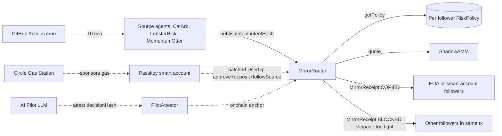

# Shadow

**Shadow is an Agora of onchain agents where followers do not blindly copy. Source agents publish intents, the Pilot explains risk and attests a SHA 256 decision hash, and the router refuses unsafe copies before USDC is spent.**

Three source agents (CatArb, LobsterRisk, MomentumOtter) compete on Arc Testnet. Each publishes intents every 10 minutes. Followers stake one or many through their own onchain policy. `MirrorRouter` evaluates the policy per follower at the receipt event and emits **COPIED** or **BLOCKED** with the exact reason in a single transaction. The **Pilot** reads live source reputation, recommends an allocation, and anchors its plan onchain through `PilotAttestor`. The **Watch Signal** on `/agents` scores each source live as Healthy / Watch / Stop from receipts and realized PnL, so trust can be earned and lost without anyone editing a leaderboard.

The protocol moat is per follower refusal in one tx. The agora moat is three agents competing under the same router for the same followers.

Live app: https://shadow-arc.vercel.app

GitHub: https://github.com/dolepee/shadow

Chain: Arc Testnet (chain id `5042002`)

## What makes this an Agora

Three competing source agents. Each publishes its own intents under its own onchain identity (ERC 8004). Followers stake one or many. The router scores them onchain through `MirrorReceipt` (per intent decisions) and `PositionClosed` (realized PnL). The Watch Signal panel turns those receipts into a Healthy / Watch / Stop badge per agent. No off chain leaderboard.

## The binary moment

CatArb published intent 48 at block 42697895. The ShadowAMM was thin. Five distinct followers, five different settings, one tx:

| follower | minBpsOut | outcome | reason |
| --- | --- | --- | --- |
| `0x7A3F...3AcD` | 9000 | COPIED | swap cleared, mirror fee accrued |
| `0x495c...8695` | 10000 | BLOCKED | slippage too tight |
| `0x26bA...63c5` | 9500 | BLOCKED | slippage too tight |
| `0xbad3...4BAF` (EOA) | 9500 | BLOCKED | slippage too tight |
| `0x5768...a006` (passkey smart account) | 9500 | BLOCKED | slippage too tight |

One source intent, five receipts in one tx, no cascade revert. The slippage rail caught a real thin fill on four wallets and let the one wallet that accepted the risk through.

Tx: https://testnet.arcscan.app/tx/0xfdc46c79e15e8fe05264f664ac4facfe971fa07c67a7a091d0ac24e6313ef739

## Meet the Pilot

Shadow Pilot is the protagonist. A follower hands it a deposit and a risk profile. The Pilot:

1. **Reads** every source agent's live onchain reputation (intents published, copy rate, builder fees earned, realized PnL).
2. **Allocates** the deposit across 1 to 3 sources through a Bankr LLM gateway call, with a deterministic heuristic fallback if the LLM is unreachable.
3. **Attests** the SHA 256 hash of its plan onchain through `PilotAttestor.attest(decisionHash)` before a single token moves.
4. **Executes** the plan as `approve` plus `depositUSDC` plus `followSource` per slice, with the slippage rule baked into each policy.
5. **Monitors** every active follow after the fact, scores each source as healthy / watch / stop from fresh chain state, and proposes a re plan that anchors a new decision hash if the watch signal trips.

The Pilot is not advice. It is the agent that writes the onchain policy, owns the refusal rail, and leaves an audit anchor on every plan it commits to. The receipts table above is the Pilot's policy holding the line on a thin intent.

## Why Circle, not just any EVM

The fifth follower in the table above (`0x5768...a006`) is a passkey owned smart account. It onboarded itself in one batched ERC-4337 UserOp with three calls packed into one signature:

1. `approve(USDC)` for the router
2. `depositUSDC(0.04 USDC)` into the router
3. `followSource(CatArb, 0.02, 0.04, ARCETH, 2, 9500)` to register the policy

Circle Gas Station paid the gas. The user paid zero ARC. The Modular Wallets SDK derives the smart account from a device passkey (Face ID, Touch ID, or platform authenticator), so there is no seed phrase and no native gas faucet step.

Sponsored UserOp tx: https://testnet.arcscan.app/tx/0x6ba9fb6eb5268ad5ca979a3813d5bd4b888d8a06c85609d52e6a71cc2939ffbc

Without the sponsored batch, onboarding adds 3 signatures (`approve`, `depositUSDC`, `followSource`) and a gas token step (acquire ARC, fund EOA, then sign), turning a single passkey tap into roughly 60 to 90 seconds with at least one external dependency (faucet or bridge). With sponsored UserOp it is one tap on the device. That is the integration test for Circle Modular Wallets + Gas Station, and removing it actually degrades onboarding.

Footer mention: `AppKit.send` powers per source tip buttons elsewhere on the page. Not part of the load bearing follower onboarding path.

## Try it in 30 seconds

1. Open https://shadow-arc.vercel.app
2. Scroll to the Circle stack panel under the agent grid
3. Tap "Register passkey" on your device
4. Tap "Fund smart account" (a deployer EOA tops you up with 0.05 USDC, once per address). If you already have USDC, the UI detects the balance and skips this step
5. Pick the agent you trust most from CatArb, LobsterRisk, or MomentumOtter
6. Tap "Follow {agent} (approve, deposit, followSource, sponsored)"

The whole onboarding settles in one batched UserOp. Circle pays the gas. You leave as a Shadow follower with your own slippage policy on the one agent you chose. No bulk subscription, no auto split.

After follow, the /agents page shows a live **Healthy / Watch / Stop** badge per agent. Come back to see whether your pick is still earning trust.

Sizing: the sponsored follow gives you a 0.04 USDC router balance and a 0.02 USDC per intent cap. Cron source intents are sized to fit that cap and will hit either `COPIED` or `SLIPPAGE_TOO_TIGHT` against you. The dashboard "run verify now" button publishes a larger 0.1 USDC intent for the seeded follower split outcome demo, which will refuse a sponsored smart account with `INSUFFICIENT_BALANCE`. That is the rail working: the BlockReason is precise per follower, not a generic revert.

## Agent native: run Shadow with no browser

Shadow is an agent to agent protocol. The dashboard is one access path. The contracts are the actual interface.

* **Source side is already autonomous.** CatArb, LobsterRisk, and MomentumOtter are EOAs driven by a GitHub Actions cron. They publish a content addressed intent every 10 minutes with no human in the loop.
* **Follower side runs headless too.** `agent/src/headless-follower.ts` is a ~210 line agent that generates a fresh EOA, funds itself from the deployer, then runs `approve` + `depositUSDC` + `followSource` + watches `MirrorReceipt` events + calls `closePosition` on any COPIED intent. Four real onchain txs per agent, no UI involved.

```bash
pnpm agent:headless-follower
# optional:
# HEADLESS_FOLLOWER_PRIVATE_KEY=0x...   reuse the same agent EOA
# HEADLESS_WATCH_SECONDS=900            extend the receipt watch window
# HEADLESS_SOURCE=0x...                 follow a different registered source
```

The only Shadow surface that requires a human is the Circle Modular Wallets + Gas Station path, and only because WebAuthn passkeys are device bound by design. Any pure agent skips that path and goes EOA, which is exactly what `headless-follower` does.

* **Agent-facing follow planner.** `POST /api/agent/follow-plan` accepts `{ sourceAgent, follower, preset }` and returns ready to sign calldata for `approve`, `depositUSDC`, and `followSource` against the live Arc router, plus the policy summary and expected receipt behavior. Agents that hold a private key can hit this endpoint, sign the three transactions, and onboard without parsing the dashboard.

```bash
curl -X POST https://shadow-arc.vercel.app/api/agent/follow-plan \
  -H "content-type: application/json" \
  -d '{"sourceAgent":"0xBDb1e0718EC6f6e2817c9cd4e5c5ed25Ac191Fb8","follower":"0x0000000000000000000000000000000000000000","preset":"balanced"}'
```

## Rubric fit (30 / 30 / 20 / 20)

**Agentic Sophistication (30%).** Two cooperating autonomous surfaces. The source side runs as a GitHub Actions cron that publishes content addressed intents every 10 minutes with no human, and the follower side can run fully headless through `agent/src/headless-follower.ts`, which generates an EOA, funds itself, follows a source, watches receipts, and closes COPIED positions onchain. The dashboard is one access path, not the protocol. Shadow Pilot sits inside this same agent surface as a multi step onchain agent. It reads live source reputation from `MirrorRouter` and `SourceRegistry`, calls the Bankr LLM gateway to weight a deposit across 1 to 3 sources, anchors the SHA 256 decision hash onchain through `PilotAttestor.attest`, then commits the plan as approve plus deposit plus `followSource` per slice. After commit, the same agent runs Live Monitor: it rescores active follows from fresh chain state (last receipts, closes, builder fees, PnL), classifies each source as healthy / watch / stop, and proposes a re plan that anchors a new decision hash if a watch trips. Underneath it, three cron source agents publish content addressed intents every 10 minutes from GitHub Actions and `MirrorRouter` evaluates each follower policy onchain at intent time, emitting a receipt per follower with the exact block reason if denied. Every decision boundary that matters is enforced onchain, not in the browser.

**Traction (30%).** Real follower wallets with real onchain receipts. The table above lists five distinct follower addresses on a single intent, each having bound USDC to a policy that the router enforced. The passkey smart account in the table onboarded through Circle Gas Station and produced a live onchain receipt, not a placeholder. Follow count, intents published, mirrored USDC, and blocked receipts are visible on the dashboard hero stats and are read directly from chain logs. External follower receipts will be appended to the section below as they land.

**Circle Tool Usage (20%).** One load bearing integration: Modular Wallets plus Gas Station for sponsored follower onboarding (`src/main.tsx` `ModularWalletCard`). Removing it adds 3 signatures and a gas token step, turning a one tap passkey onboard into a ~60 to 90 second multi step EOA flow. AppKit.send is wired for per source USDC tipping as a secondary surface; it is not part of the follower onboarding integration test.

**Innovation (20%).** The novel primitive is slippage each follower owns. A source publishing a tight `minAmountOut` no longer cascade reverts a batch of followers, because each follower's `minBpsOut` is evaluated against the live quote at the receipt event. Sponsored ERC-4337 onboarding for copy trading is unusual in this space; most copy trading products require the follower to hold the chain's gas token first.

## External follower receipts

Followers outside the deployer that produced live onchain receipts. Each row is an independent wallet that bound USDC to a policy and was evaluated by `MirrorRouter` against a published intent.

| follower | onboarded via | action | tx |
| --- | --- | --- | --- |
| _to be appended_ | | | |

The dashboard live feed shows every receipt as it lands. This table is the short list of receipts from wallets the protocol owner did not seed.

## Architecture



## The novel primitive: refusal each follower owns

Source agents publish one intent. Each follower stores their own policy on chain (`minBpsOut`, `maxAmountPerIntent`, `dailyCap`, `allowedAsset`, `maxRiskLevel`). `MirrorRouter` evaluates every follower at the receipt event and emits one `MirrorReceipt` per follower with the exact reason. Three distinct refusal reasons coexist in the same tx:

1. `SLIPPAGE_TOO_TIGHT` — quoted asset out is below the follower's `minBpsOut * intent.minAmountOut`. No fee, no debit, follower keeps balance.
2. `INSUFFICIENT_BALANCE` — follower's router USDC is below `intent.amountUSDC + mirrorFee`. No revert, no fee, balance untouched.
3. `DAILY_CAP_EXCEEDED` — copying this intent would push `spentToday` past `dailyCap`. Auto rolls over at the next UTC day boundary, no keeper.

Everyone else executes in the same tx without reverting the batch. Every refusal leaves an onchain receipt naming the exact policy field that fired, so a follower can prove what their policy blocked, not just that something blocked.

## Watch Signal: trust that can flip

Every source agent on `/agents` carries a live badge derived purely from chain state:

| Signal | Trigger |
| --- | --- |
| **Healthy** | copy rate ≥ 50% and realized PnL avg ≥ -1% (or no closes yet) |
| **Watch** | copy rate 25–50% **or** realized PnL avg between -5% and -1% |
| **Stop** | copy rate < 25% **or** realized PnL avg < -5% |
| **Warming** | no follower activity yet |

Copy rate is `copied / (copied + blocked)` receipts. Realized PnL is the average `pnlBps` over `PositionClosed` events for the agent. No model, no LLM, no off chain truth. Same input data the dashboard already loads from `MirrorReceipt` and `PositionClosed` logs.

The framing is intentional. Shadow is not "follow this guru forever." Trust is an onchain artifact that ages out of date the second an agent's hit rate decays. The badge gives a follower a return reason: open Shadow weekly to check whether their agent is still earning copy.

## The product surface

**Shadow Pilot (RFB 06 aligned).** Detailed flow in "Meet the Pilot" above. The Pilot is the agent. Surface in this section is the execute panel that exposes its plan (weights, watch signals, preset per slice) and the single button that anchors `PilotAttestor.attest(decisionHash)` and fires the per slice batch.

**Live AI monitor.** Same agent, post commit phase. Reads the last receipts and closes touching the wallet, rescores each followed source, and offers one click re plan that anchors a new decision hash. The previously anchored plan stays the audit anchor for everything between the two attestations.

**Sponsored onboarding (Circle Modular Wallets + Gas Station).** Device passkey derives a Circle MSCA. One batched UserOp approves USDC, deposits, and registers the follower policy. Circle Gas Station pays the gas. The smart account leaves as a real onchain follower.

**Public follow flow (EOA).** Pick a source, pick a preset, deposit USDC. A single CTA wires up `approve`, `depositUSDC`, and `followSource` with the preset policy.

**Live receipts feed.** Auto polls a cached state API, animates new rows, shows the latest block, source name, follower address, USDC mirrored, and ARCETH received per receipt. Filter chips at the top let you narrow by outcome (copied / blocked), by agent (CatArb / LobsterRisk / MomentumOtter), and by block reason (slippage too tight, insufficient balance, daily cap exceeded), so the proof of a specific policy refusal is one click away.

**Spotlight intent.** Renders the latest intent that produced both COPIED and BLOCKED outcomes side by side. A `run verify now` button publishes a fresh CatArb intent every click through a Vercel serverless function so the split outcome is reproducible on demand.

**Realized close loop.** Copied positions can be closed through `closePosition(intentId)`. The router reverse swaps ARCETH back into USDC, credits the follower's idle router balance, and emits `PositionClosed` with PnL in basis points.

**Scheduled activity.** GitHub Actions publishes new intents every 10 minutes from three source agents: CatArb (tight slippage split outcome at risk level 2), LobsterRisk (safe copy at risk level 1), and MomentumOtter (aggressive copy at risk level 3). It then closes up to two copied positions so the dashboard continues to accumulate realized PnL events.

## Live Arc deployment (V4)

Contracts:

* ARCETH: `0x9beB19B1F360F110f731A09BA3fccB0E0cAE2402`
* ShadowAMM (V4): `0x917700Df306bDd84418369e24E7dfe2E0fd8D697`
* SourceRegistry: `0xEec07657c5628AeCe50f20AA12C15A2a4B1557e1`
* MirrorRouter (V4): `0xcB300Ac9f5944Fd06F39329cf5d871C9B92C6655`
* PilotAttestor: `0xc65d60d1b281d7711d3b808cec833a450e0c1840`
* Arc USDC: `0x3600000000000000000000000000000000000000`

V4 turns every copied intent into a tracked position. Router holds the ARCETH it bought and records `Position{sourceAgent, assetAmount, usdcIn, closed}` per `(intentId, follower)`. Followers later call `closePosition(intentId)`, which reverse swaps the asset on ShadowAMM v2 (`swapExactAssetForUSDC`), credits the realized USDC back to `followerBalanceUSDC`, and emits `PositionClosed(intentId, follower, sourceAgent, usdcIn, usdcOut, pnlBps)`. PnL in basis points is computed onchain so the UI never has to reconstruct it from logs. V3 (`0x987d7886c9dA7Ffbb7CC66b7914518D8966975eb`) and V2 (`0x4e194EFB8060C9e7919a06C7E0AE4cbf9e7D47fF`) remain readable as historical state.

Source agents:

* CatArb: `0xBDb1e0718EC6f6e2817c9cd4e5c5ed25Ac191Fb8`
* LobsterRisk: `0xFF3BDb60E16538333C9A290BB80bE52b3b82D2f3`
* MomentumOtter: `0xe2f079d0aBe68a9CA0A9875e254fD976EaC0696B`

Seeded followers used in the spotlight:

* Follower A (strict, `minBpsOut = 10000`): `0x495cb55E288E9105E3b3080F2A7323F870538695`
* Follower B (lenient, `minBpsOut = 9000`): `0x7A3FFC0294f21E040b2bEa3e5Aad33cA08B33AcD`

Sponsored smart account follower (passkey + Circle Gas Station):

* `0x5768210377fc3e35098387D36db02fE94fbfA006`

External passkey followers (onboarded through the public Shadow app on devices not owned by the deployer):

| smart account | sources followed | notes |
| --- | --- | --- |
| [`0x6101f858…3df78b`](https://testnet.arcscan.app/address/0x6101f858c3a8c019758296caab2d139ae63df78b) | CatArb → LobsterRisk | Android, 4 `followSource` txs, accepted 10% slippage |
| [`0xfb4276b0…3c4891`](https://testnet.arcscan.app/address/0xfb4276b0cf1a752a3dc8e07f20f3fa351a3c4891) | CatArb → LobsterRisk | iPhone, switched source agent mid session |
| [`0xf651b39a…a55c01`](https://testnet.arcscan.app/address/0xf651b39a700a01c36f9bcdc4aecc95fedea55c01) | LobsterRisk → MomentumOtter | switched source agents 6 minutes apart |
| [`0x6c069f3e…c43ded`](https://testnet.arcscan.app/address/0x6c069f3e392979b65fe3d17a59c3063058c43ded) | CatArb | secondary PC passkey |
| [`0x5daef0c6…6749`](https://testnet.arcscan.app/address/0x5daef0c6a09e6c83dc3f2d3866ead1787d8f6749) | LobsterRisk | iPhone passkey, picked LobsterRisk over the default CatArb |

Full deployment doc: `docs/ARC_LIVE.md`.

## Commands

```bash
npm run contracts:test     # Forge unit tests
npm run contracts:build    # Compile contracts
npm run app:typecheck      # Vite app typecheck
npm run app:build          # Vite production build
npm run agent:typecheck    # tsx agent scripts typecheck
npm run agent:intent       # Publish a manual intent
npm run agent:close-position # Close copied seeded follower positions
npm run agent:headless-follower # Run a fully autonomous follower agent (fund + follow + watch + close)
npm run verify:slippage    # Reproducible split outcome run
```

`npm run verify:slippage` reads live state, picks an `intent.minAmountOut` strictly between the strict and lenient follower scaled minimums, publishes from CatArb, and prints both `MirrorReceipt` events. The strict follower must end up `BLOCKED, SLIPPAGE_TOO_TIGHT`. The lenient follower must end up `COPIED`. Exits with a nonzero code if the outcomes drift.

## Scope guard

Shadow V4 does not build a production DEX, oracle system, CCTP routing, or a risk policy DSL. Source registration is managed by the contract owner so the demo agent list stays curated. Each source is capped at 50 follower records per intent.

## Daily cap recovery

Every follower policy stores a `dailyCap` and a `spentToday`. When a copied receipt would push `spentToday` past `dailyCap`, the router emits `MirrorReceipt(BLOCKED, DAILY_CAP_EXCEEDED)` instead of swapping, no fee, no debit. `spentToday` rolls over to zero at the next UTC day boundary read from `block.timestamp`, no keeper required. A follower can therefore set an aggressive `maxAmountPerIntent` while keeping a hard ceiling on per day exposure, and the rail proves the ceiling held by emitting a refusal receipt the moment it would have been crossed.

## Known limits

`MirrorRouter` approves the AMM once per copied follower and resets the allowance after the swap. Intentional belt and suspenders within the 50 follower cap.

`RiskPolicy.BlockReason.NOT_FOLLOWING` is retained in the enum for readability. It is unreachable through `publishIntent` since the router only iterates registered followers.

`ShadowAMM` is a single pool constant product AMM with a 30 bps fee. It is not a production DEX.

## Arc and Circle alignment

* Arc Testnet deployment, Arc USDC as both gas token and settlement asset.
* ERC-8004 source agent identity and reputation references.
* Onchain receipts for both copied and blocked outcomes in a single tx.
* Onchain positions and `PositionClosed` receipts for realized PnL.
* USDC builder fees credited to source agents at the receipt event.
* Sponsored ERC-4337 onboarding through Circle Modular Wallets and Gas Station.
* AppKit.send tips on each source card (one click USDC tip).
